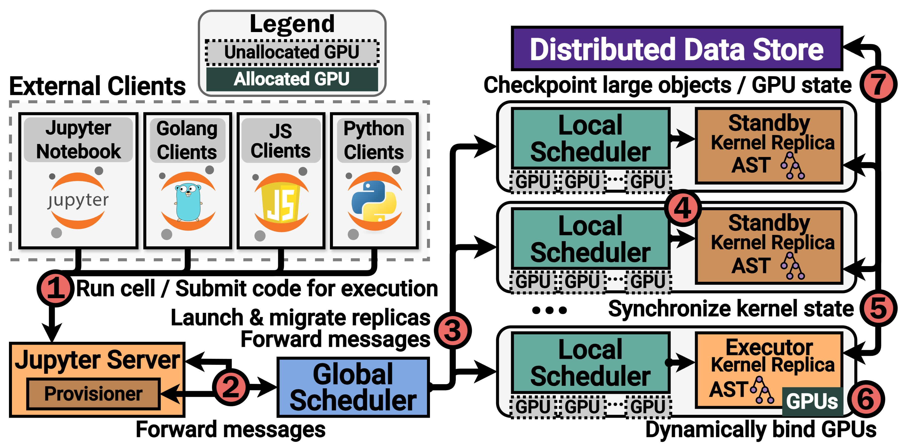

# NotebookOS — a Jupyter Notebooks-as-a-Service Platform 

Welcome to the NotebookOS — a fully-featured prototype designed for GPU-based machine learning training workloads. 
This platform provides seamless integration with powerful monitoring and analytics tools, making it ideal for data scientists and machine learning engineers.
It is also designed to provide a high degree of interactivity, making it well-suited for interactive programming sessions and thus a great tool for students.

**Note:** there is a dashboard and workload orchestrator component intended to be deployed alongside NotebookOS. The repository for that is available [here](https://github.com/ds2-lab/NotebookOS-Dashboard).

## Key Features

- **GPU-Accelerated Notebooks** 🚀: Leverage GPU power for machine learning and deep learning workloads.

- **Fully-Featured Jupyter Environment** 💻: Provides a robust Jupyter environment for interactive data analysis and model development.

- **Integrated Monitoring & Analytics** 📈:

  - Prometheus for time-series data monitoring 🔍

  - Promtail for log collection 🪵

  - Loki for efficient log aggregation ♻️

  - Grafana for real-time data visualization and log viewing 📊

## Design

Please refer to the `docs/` directory for additional diagrams (including the architecture diagram for Kubernetes-based
deployments) and a high-level description of the platform's core components.



## Running the Unit Tests

The `run_unit_tests_swarm.sh` file in the project root directory will run all Golang unit tests.

If you set the `VERBOSE` environment variable to any non-empty value (e.g., `VERBOSE=1`), then debug logging will be
enabled during the unit tests.

There is another script `distributed-notebook/distributed_notebook/tests/run_unit_tests.sh` which will run the Python
unit tests. 

## System Installation

### Prerequisites

Ensure you have the following installed:

- Docker & Docker Compose (for single-node deployments)
  
- NVIDIA Container Toolkit (optional for GPU support)  

- Docker Swarm or Kubernetes (optional for large-scale deployments)

For instructions concerning the setup and installation of `distributed-notebook` on either a single machine or on a 
cluster, please refer to the `setup` directory.

This system was largely developed, tested, and evaluated on WSL2 and Ubuntu (on AWS EC2). 

#### WSL2 
The WSL2 development environment was as follows:
- Docker: Docker version 27.2.0, build 3ab4256
- Go: `go version go1.22.9 linux/amd64`
- Python: `Python 3.12.6`
- Protoc: `libprotoc 27.2`
- Microsoft Windows Version 22H2 (OS Build 19045.5487)
  - 10.0.19045.5487
- WSL version: 2.4.11.0
- Kernel version: 5.15.167.4-1
- WSLg version: 1.0.65
- WSL Distro: `Ubuntu 22.04.5 LTS`
  - Distributor ID: Ubuntu
  - Description:    Ubuntu 22.04.5 LTS
  - Release:        22.04
  - Codename:       jammy

```sh
$ nvidia-smi --version
NVIDIA-SMI version  : 565.77.01
NVML version        : 565.77
DRIVER version      : 566.36
CUDA Version        : 12.7
```

#### AWS EC2
The AWS EC2 development and evaluation environment was as follows:
- Docker: `Docker version 27.3.1, build ce12230`
- Go: `go version go1.22.9 linux/amd64`
- Python: `Python 3.12.6`
- Protoc: `libprotoc 27.2`
``` sh
$ lsb_release -a
Distributor ID: Ubuntu
Description:    Ubuntu 24.04.1 LTS
Release:        24.04
Codename:       noble
```

## Remote Storage

Jupyter kernel state can be persisted to one of several remote storage options, including AWS S3, HDFS, and Redis.

### AWS S3

The system was developed, tested, and evaluated on AWS EC2. In order to grant the kernels access to AWS S3 buckets, we
created an IAM role with access to the necessary AWS S3 buckets. All the EC2 instances we used were assigned this 
IAM role, thereby providing access to the AWS S3 bucket to all kernels running on/within the EC2 virtual machines.

If you wish to use AWS S3 for intermediate storage but are not running on AWS S3, then you must find another means to
configure the various AWS clients. 

#### Environment Variables
One option is to modify the `DockerInvoker` struct to set the following environment
variables: `AWS_ACCESS_KEY_ID`, `AWS_SECRET_ACCESS_KEY`, `AWS_SESSION_TOKEN`, and `AWS_WEB_IDENTITY_TOKEN_FILE`. The 
last one (`AWS_WEB_IDENTITY_TOKEN_FILE`) is probably not required.

The `DockerInvoker` struct is implemented in `local_daemon/invoker/invoker.go`. The `DockerInvoker` struct is created
by the `LocalScheduler`, which is defined in `local_daemon/daemon/local_daemon.go`. 

This option should work, but there are security risks associated with passing in these values as environment variables.

#### `credentials` and `config` Files
Another option is to somehow modify the Docker image you are using for the Jupyter kernels to have a `credentials` file
and a `config` file available under the `~/.aws/` directory within the image. (This directory would probably need to
be created at `/home/jovyan/.aws`.) There are, of course, security concerns with this approach as well.

#### Other Options

For a more in-depth discussion of the various options, consider reading the official AWS SDK documentation, such as the
[AWS SDK for Go v2](https://docs.aws.amazon.com/sdk-for-go/v2/developer-guide/configure-gosdk.html) documentation, or
the [AWS SDK for Python (Boto3)](https://aws.amazon.com/sdk-for-python/) documentation.

## Jupyter Kernel

``distributed_kernel`` is a Jupyter kernel that can execute in a distributed (i.e., replicated) fashion. 

### Build

Follow https://github.com/scusemua/gopy and execute:

~~~bash
$ python3 -m pip install pybindgen
$ go install golang.org/x/tools/cmd/goimports@latest
$ go install github.com/scusemua/gopy@go-python-master
$ make 
~~~

Gopy compatibility:

- `Mac Intel`: **PREVIOUSLY OK, NOW UNKNOWN**
- `Mac ARM`: **PREVIOUSLY OK, NOW UNKNOWN**
- `Linux AMD`: **OK**
- `Windows 10`: **BUILD ISSUES**
- `Other`: **UNKNOWN**

### Preparation

Start jupyter container.

    cd dockfiles/jupyter
    docker-compose up -d  # docker compose up -d for new docker version on Mac.

I have prepared built SMR for mac running on ARM. To build SMR for different arch, we may need to build a local "scusemua/gopy" image first.

    # In other folder.
    git clone https://github.com/scusemua/gopy.git
    docker build -t scusemua/gopy .

    # Go to the smr/ directory and build.
    cd <root directory>/smr
    make build-linux-amd64

    # Go back to the root directory and build.
    cd ../
    make build-smr-linux-amd64

## Common Errors:

### glibc Issues
```
./gateway: /lib/x86_64-linux-gnu/libc.so.6: version `GLIBC_2.34' not found (required by ./gateway)
```

If you see the above error, then try rebuilding *all* Docker images locally, including the base image. Specifically, rebuild these images (in roughly this order):
- `dockfiles/base-image`
- `dockfiles/cpu-python3-amd64` (or `dockfiles/cpu-python3-arm64`, depending on your CPU architecture)
- `dockfiles/gateway`
- `dockfiles/local_daemon`

Once rebuilt, you can redeploy the application and see if that issue is resolved. If the error persists, then you may have an incompatible glibc version installed locally (compared to the glibc version found within the Docker images).

You can see the version number of your locally-installed glibc via `ldd --version`. You can see the version installed within the Docker containers by running one of the containers and executing that command:
``` sh
docker run -it --entrypoint /bin/bash <container id>
ldd --version
```

At the time of writing this, the glibc version found in the Gateway and Local Daemon Docker containers is: `ldd (Debian GLIBC 2.36-9+deb12u7) 2.36`

The version found within the Jupyter Docker container is: `ldd (Ubuntu GLIBC 2.35-0ubuntu3.8) 2.35`

### Kernel Replica Containers/Pods Crashing with No Error Messages in Logs (Exit Code 134)

If the container/pod exits with error code 134, then this indicates that the application terminated with the 'Aborted' signal (SIGABRT) -- at least in the case of Docker containers. This indicates that there was a critical error during the application's execution. 

It seems common that, if such an error occurs within the Golang code of kernel, then it will often exit without flushing everything to `stdout`/`stderr` (whic is weird, because I thought `stderr` was typically unbuffered?). In any case, if you're observing crashes with nothing helpful in the logs, then common issues may be that the kernels are failing to connect to HDFS or each other (i.e., network connectivity issues of some kind). There may also be some other kind of issue within the Golang code that is causing the kernel to crash.

Ensure that the HDFS hostname being passed to the kernels is (a) correct, and (b) usable from within the container/pod. For example, if you're running HDFS on your host VM and the kernels in Docker containers on that VM, then they can probably connect via something like `172.0.17.1:9000` if the network mode of the container is bridge (`--network 'bridge'`, or you deployed the cluster using `docker compose`, which creates a default network). If you use such a hostname without the proper network configuration, then the HDFS connection will fail.

### `dial unix /var/run/docker.sock: connect: permission denied`

If you get a `panic` in the Cluster Gateway container with that as the reason, then there are several possibilities.

One possibility is that the permissions on your system's Docker socket (`/var/run/docker.sock`) are too restrictive. This can be changed via `chmod 666 /var/run/docker.sock`, though note that this is a significant security risk.

Another possibility is that the `docker` group within the container does not have the same ID as the `docker` group on your host system. To address this, first rebuild the "base" Docker image and then rebuild the Cluster Gateway's Docker image. (Note that this likely won't work if you already built these images locally. That is, this may happen if you use the images available on Dockerhub, but if you built them locally already, then this likely won't address the issue.)

The base image is located at `dockfiles/base-image` while the Cluster Gateway's image is located at `dockfiles/gateway`.

See [this](https://stackoverflow.com/a/41574919/5937661) StackOverflow post for details.
