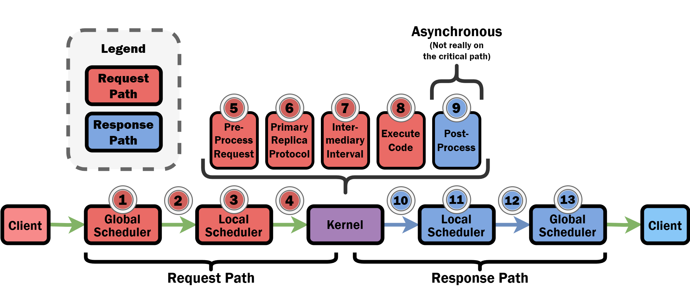

# Project Architecture - Docker Swarm

The following diagram reflects the current system architecture when the system is deployed atop a Docker Swarm cluster.

To see the architecture of the `Global Scheduler` component specifically, please refer to the architecture diagram 
shown in the `README.md` located in `distributed-notebook/gateway/README.md`.

## Clients

Similar to conventional Jupyter environments, clients interact with the platform by transmitting notebook operations 
via HTTP or WebSocket messages to the platform’s Jupyter Server (Step 1 in the architecture diagram).

## Jupyter Server

The Jupyter Server delivers essential services, exposing APIs and REST endpoints that are utilized by Jupyter web 
applications such as [Jupyter Notebook](https://jupyter.org/) and [JupyterLab](https://jupyterlab.readthedocs.io/en/latest/).

## Global Scheduler

The Global Scheduler is tasked with creating distributed kernels and overseeing the provisioning of their replicas, a 
process delegated to another component known as the Local Scheduler. It handles most of the platform’s resource 
management, including assigning compute resources (CPUs, host memory, and GPUs) to Distributed Kernel replicas, 
managing failures, migrating kernel replicas, and enabling auto-scaling. 

Additionally, the Global Scheduler facilitates message routing from Jupyter clients to the appropriate Distributed Kernel 
replicas. Each message sent from a Jupyter client and relayed by the Jupyter Server (Step 2) includes details such as 
the unique identifier of the intended kernel. The Global Scheduler examines this information and directs the message to 
the corresponding kernel replicas. Messages are first forwarded to the Local Scheduler of the designated kernel 
replica (Step 3).

## Local Scheduler

The platform deploys a Local Scheduler on each GPU server, which is responsible for forwarding messages from the Global 
Scheduler to the relevant kernel replica on its host machine. It also handles the provisioning and lifecycle management 
of the containers hosting the kernel replicas, ensuring proper cleanup when a kernel shuts down. When the Local 
Scheduler receives a message from the Global Scheduler, it forwards it to the appropriate kernel replica (Step 4).

## Distributed Kernel. 

The Distributed Kernel comprises three replicas that use the Raft SMR protocol to replicate and synchronize the 
CPU-memory state of the IPython process (Step 5). To determine which replica will execute GPU tasks, the platform 
employs a lightweight executor election protocol that selects a replica with adequate GPU resources (Step 6).

## Distributed Data Store. 

The platform relies on a Distributed Data Store for storing and replicating large objects (Step 7). Large data items, 
such as model parameters, are saved in the Distributed Data Store and asynchronously copied whenever the platform 
detects GPU overload, prompting a switch to a different executor replica or the migration of an existing one to another 
GPU server. 

The platform supports multiple different distributed data store implementations, including 
[AWS S3](https://aws.amazon.com/s3/), [HDFS](https://hadoop.apache.org/docs/r1.2.1/hdfs_design.html), and 
[Redis](https://www.redis.io/). Adding support for additional storage backends is trivial and involves implementing a 
simple Python interface.

# Project Architecture - Kubernetes

The following diagram reflects the current system architecture when the system is deployed atop a Kubernetes cluster.

Note that the Kubernetes-based deployment mode has (temporarily) fallen out of favor and is not as up-to-date as the
Docker Swarm deployment mode.

# Socket Connections

The following diagram displays how all the components are connected together via ZMQ sockets.

# Key Steps Along Critical Path of `"execute_request"` Messages

This diagram displays the key steps along the critical path taken by `"execute_request"` messages (i.e., user-submitted 
code execution requests).

