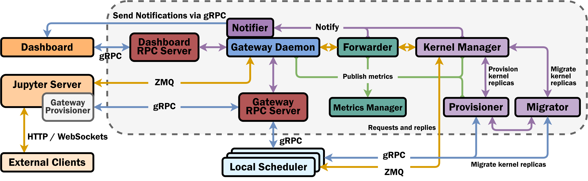

# Global Scheduler / Cluster Gateway

## Organization
- `internal/`: the core business logic of the Global Scheduler.
- `cmd/`: the executable/driver for the Global Scheduler.

## Architecture

### gRPC Servers

There are two gRPC servers used by the Cluster Gateway. They are both defined in `internal/rpc`.

The first is the Dashboard RPC Server. This server establishes a bidirectional gRPC connection with the Cluster Dashboard.
The Cluster Gateway sends RPC requests to the Dashboard to deliver notifications to the frontend UI. The Dashboard
sends RPC requests to the Cluster Gateway to retrieve information about the platform and the various kernels running within
the platform.

The second is the Gateway RPC Server. This server establishes bidirectional gRPC connections with all Local Schedulers
running within the platform. The Gateway Provisioners created within the Jupyter Server also establishes (unidirectional)
gRPC connections with the Gateway RPC Server in order to create Distributed Kernels.

### **Gateway Daemon**

The **Gateway Daemon** centralizes all the individual components that make up the Cluster Gateway. The 
**Gateway Daemon** delegates task to the appropriate component.

### **Notifier** 

The **Notifier** is responsible for delivering notifications (sent via gRPC) to the frontend UI. These
notifications are submitted as gRPC requests to the Cluster Dashboard, which then sends them to the frontend UI via
HTTP or WebSockets.

### **Forwarder**

The **Forwarder** consumes ZMQ messages received by the Cluster Gateway and routes them through the 
**Kernel Manager** component.

### **Kernel Manager**

The **Kernel Manager** is responsible for all bookkeeping and management of Distributed Kernels within the Cluster
Gateway. The **Kernel Manager** receives ZMQ messages from the Forwarder and routes them to the appropriate handler.
The **Kernel Manager** delegates kernel creation operations to the **Provisioner** and kernel migration operations to
the **Migrator**.

### **Metrics Manager**

The **Metrics Manager** is responsible for maintaining all metrics and statistics relevant to the Cluster Gateway.
The **Metrics Manager** is also responsible for serving the metrics on an HTTP endpoint such that they can be scraped
by Prometheus.